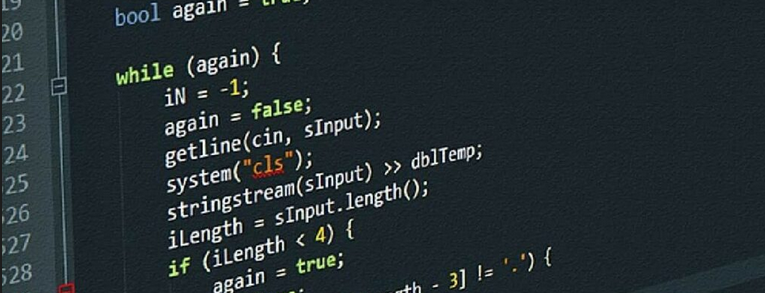
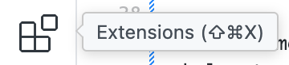
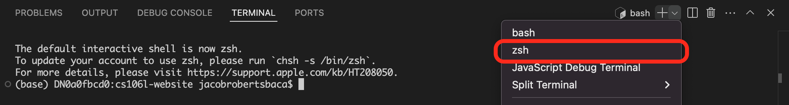

# 作业环境配置

截止时间：4 月 17 日（星期五）23:59

## 概述

欢迎来到 CS106L！本作业会帮助你配置本学期后续作业所需的开发环境。完成后，你应该能够在 VSCode 中编译并运行 C++ 文件，也能够运行后续每次作业都会使用的自动评分器。

如果配置过程中遇到问题，请在 [EdStem](https://edstem.org/us/courses/81492/discussion) 上联系我们，或前往答疑时间寻求帮助。

## 第 1 部分：安装 Python

### 1.1 检查现有的 Python 安装

CS106L 每次作业的自动评分器都会使用 Python，因此你必须安装 `3.8` 或更高版本。可在终端中运行以下命令检查版本。

Linux 或 macOS：

```sh
python3 --version
```

Windows：

```sh
python --version
```

如果版本不低于 `3.8`，说明环境符合要求，**可以直接继续第 2 部分**；否则请按照 1.2 节安装 Python。

### 1.2 安装 Python（尚未安装时）

#### macOS 与 Windows

请从 [Python 官网](https://www.python.org/downloads/)下载最新版本并运行安装程序。**Windows 用户必须在安装程序中勾选 `Add python.exe to PATH`。**安装完成后，请按照 **1.1 节**验证是否成功。

#### Linux

以下说明适用于 Ubuntu 等基于 Debian 的发行版，并已在 Ubuntu 20.04 LTS 上测试。

1. 更新 Ubuntu 软件包列表：

    ```sh
    sudo apt-get update
    ```

2. 安装 Python：

    ```sh
    sudo apt-get install python3 python3-venv
    ```

3. 重启终端并验证安装：

    ```sh
    python3 --version
    ```

## 第 2 部分：配置 VSCode 与 C++ 编译器

本课程使用 VSCode 编写 C++ 代码。请根据你的操作系统安装 VSCode 和 GCC 编译器。

### macOS

#### 第一步：安装 VSCode

打开 [VSCode 的 macOS 安装说明](https://code.visualstudio.com/docs/setup/mac)，下载 Visual Studio Code，并按照网页中 **Installation** 一节完成安装。

在 VSCode 中打开扩展面板 </img>，搜索 **C/C++**，然后安装 **C/C++** 扩展。

最后，打开命令面板（<kbd>Cmd+Shift+P</kbd>），搜索并选择 `Shell Command: Install 'code' command in PATH`。完成后即可在终端中运行 `code` 来启动 VSCode。

**🥳 至此，你的 Mac 上应该已经成功安装 VSCode 👏**

#### 第二步：安装 C++ 编译器

1. 运行以下命令检查是否安装了 Homebrew：

    ```sh
    brew --version
    ```

   如果输出类似：

    ```sh
    Homebrew 4.2.21
    ```

   请直接跳到第 3 步；如果输出异常，则继续第 2 步。

2. 运行以下命令：

    ```sh
    /bin/bash -c "$(curl -fsSL https://raw.githubusercontent.com/Homebrew/install/HEAD/install.sh)"
    ```

    该命令会下载并安装 macOS 软件包管理器 Homebrew 🍺。

3. 安装 GCC：

    ```sh
    brew install gcc
    ```

4. 记下 Homebrew 安装的 GCC 版本。大多数情况下命令名为 `g++-14`。macOS 默认会把 `g++` 指向系统内置的 `clang`，可运行以下命令进行调整：

    ```sh
    echo 'export PATH="$(brew --prefix)/bin:$PATH"\nalias g++="g++-14"' >> ~/.zshrc
    ```

    如果安装的版本不是 `g++-14`，请将命令中的版本号替换为实际版本。

5. 重启终端并验证安装：

    ```sh
    g++ --version
    ```

> [!NOTE]
> 如果你通过 VSCode 运行代码，执行最后一条命令时可能遇到问题。请确认 VSCode 内使用的是 `zsh` 终端，如下图所示：
> 
> 本课程每次运行 `g++` 时都需要使用 `zsh`。你也可以按 <kbd>Cmd+Shift+P</kbd>，依次选择 **Terminal: Select Default Profile** 和 **`zsh`**，将其设为默认终端。

### Windows

#### 第一步：安装 VSCode

打开 [VSCode 的 Windows 安装说明](https://code.visualstudio.com/docs/setup/windows)，下载 Visual Studio Code，并按照网页中 **Installation** 一节完成安装。

在 VSCode 中打开扩展面板 </img>，搜索并安装 **C/C++** 扩展。

**🥳 至此，你的电脑上应该已经成功安装 VSCode 👏**

#### 第二步：安装 C++ 编译器

1. 按照 [VSCode 文档](https://code.visualstudio.com/docs/cpp/config-mingw)中 **Installing the MinGW-w64 toolchain** 一节安装工具链。

2. 完成全部步骤后，运行以下命令验证安装：

    ```sh
    g++ --version
    ```

### Linux

以下说明适用于 Ubuntu 等基于 Debian 的发行版，并已在 Ubuntu 20.04 LTS 上测试。

#### 第一步：安装 VSCode

打开 [VSCode 的 Linux 安装说明](https://code.visualstudio.com/docs/setup/linux)，下载 Visual Studio Code，并按照网页中 **Installation** 一节完成安装。

在 VSCode 中打开扩展面板 </img>，搜索并安装 **C/C++** 扩展。

最后，打开命令面板（<kbd>Ctrl+Shift+P</kbd>），搜索并选择 `Shell Command: Install 'code' command in PATH`。完成后即可在终端中运行 `code` 来启动 VSCode。

**🥳 至此，你的 Linux 系统上应该已经成功安装 VSCode 👏**

#### 第二步：安装 C++ 编译器

1. 更新 Ubuntu 软件包列表：

    ```sh
    sudo apt-get update
    ```

2. 安装 `g++` 编译器：

    ```sh
    sudo apt-get install g++-10
    ```

3. 系统默认会使用当前配置的 `g++`。可以通过以下命令切换到刚安装的 G++ 10（或更高版本）：

    ```sh
    sudo update-alternatives --install /usr/bin/g++ g++ /usr/bin/g++-10 10
    ```

4. 重启终端并验证 GCC 是否安装成功。`g++` 版本必须不低于 10：

    ```sh
    g++ --version
    ```

## 第 3 部分：使用 Git 克隆课程代码

Git 是一种常用的版本控制系统（VCS），本课程用它分发作业起始代码。请先运行以下命令确认 Git 已安装：

```sh
git --version
```

如果输出异常，请从 [Git 官网](https://git-scm.com/downloads)下载并安装 Git。

### 下载起始代码

打开 VSCode，再打开终端（按 <kbd>Ctrl+`</kbd>，或从窗口顶部选择 **Terminal > New Terminal**），然后运行：

```sh
git clone https://github.com/scandishoper/cs106l-.git
```

该命令会把本中文仓库下载到 `cs106l-` 文件夹。

### 打开 VSCode 工作区

完成课程作业时，建议直接把对应作业目录作为 VSCode 工作区打开。克隆仓库后，先进入环境配置目录：

```sh
cd cs106l-/assignment-setup
```

然后打开专用于此目录的 VSCode 工作区：

```sh
code .
```

现在就可以开始了。

### 获取作业更新

仓库更新已有作业或发布新作业后，在 `cs106l-` 目录中运行：

```sh
git pull origin main
```

即可获取最新的起始代码。

## 第 4 部分：测试开发环境

接下来编译第一个 C++ 文件并运行自动评分器。打开 VSCode 终端（按 <kbd>Ctrl+`</kbd>，或选择 **Terminal > New Terminal**），确认当前位于 `assignment-setup/` 目录，然后运行：

```sh
g++ -std=c++23 main.cpp -o main
```

这会把 C++ 源文件 `main.cpp` **编译**为名为 `main` 的可执行文件，其中包含处理器能够执行的机器码。如果编译没有报错，请继续运行：

```sh
./main
```

该命令会执行 `main.cpp` 中的 `main` 函数，并运行自动评分器来检查环境配置是否正确。

> [!NOTE]
>
> ### Windows 用户说明
>
> Windows 上可能需要使用以下命令编译才能看到输出：
>
> ```sh
> g++ -static-libstdc++ -std=c++20 main.cpp -o main
> ```
>
> 生成的可执行文件也可能名为 `main.exe`，此时请运行：
>
> ```sh
> ./main.exe
> ```

> [!NOTE]
>
> ### macOS 用户说明
>
> 编译时可能因缺少 `wchar.h`（或类似文件）而报错。此时可能需要运行以下命令，重新安装 Xcode 命令行工具：
>
> ```sh
> sudo rm -rf /Library/Developer/CommandLineTools
> sudo xcode-select --install
> ```
>
> 完成后应该可以正常编译。

## 🚀 完成配置后

编译并运行后，如果自动评分器显示如下结果：


说明你已经完成环境配置！现在可以继续学习[作业 1](../assignment1/README.md)。
