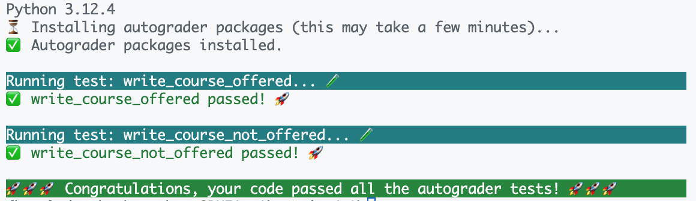

# 作业 1：SimpleEnroll

截止时间：4 月 17 日（星期五）23:59

## 配置 C++ 环境

请先按照[环境配置作业](../assignment-setup/README.md)中的说明配置 C++ 编译器与自动评分器。

## 概述

又到本学期使用 SimpleEnroll 的时候了 🤗。每个斯坦福学生迟早都会意识到自己终究要毕业，因此选课逐渐变成了一项策略任务：既要最大化毕业进度，又要争取每晚睡够四小时！

在这份较短的作业中，我们将使用 ExploreCourses API 的数据，判断 ExploreCourses 中哪些 CS 课程在今年开设、哪些没有开设。你会练习 C++ 的流、初始化和引用。现在开始吧 ʕ•́ᴥ•̀ʔっ

你只需要关注两个文件：

- `main.cpp`：你的所有代码都写在这里 😀。
- `utils.cpp`：包含一些工具函数。你会使用其中定义的函数，但通常不需要修改它。

## 运行代码

运行前需要先编译。打开终端（VSCode 中可按 <kbd>Ctrl+`</kbd>，或选择窗口顶部的 **Terminal > New Terminal**），确认当前位于 `assignment1/` 目录，然后运行：

```sh
g++ -std=c++20 main.cpp -o main
```

如果编译没有报错，请运行：

```sh
./main
```

这会执行 `main.cpp` 中的 `main` 函数，并启动自动评分器检查代码是否正确。

完成下述步骤时，建议经常重新编译并运行自动评分器，以便及时确认方向是否正确。

> [!NOTE]
>
> ### Windows 用户说明
>
> Windows 上可能需要使用以下命令编译才能看到输出：
>
> ```sh
> g++ -static-libstdc++ -std=c++20 main.cpp -o main
> ```
>
> 生成的可执行文件也可能名为 `main.exe`，此时请运行：
>
> ```sh
> ./main.exe
> ```

## 第 0 部分：阅读代码并补全 `Course` 结构体

1. 本作业使用 `Course` 结构体表示从 ExploreCourses 获取的记录。查看 `main.cpp` 中尚未完成的 `Course` 定义，并补全字段类型。后续我们会通过流生成 `Course` 对象——想一想流所处理的数据是什么类型。

2. 查看 `main.cpp` 中的 `main` 函数，特别留意 `courses` 是如何传给 `parse_csv`、`write_courses_offered` 和 `write_courses_not_offered` 的。思考这些函数会对数据做什么，以及函数声明是否需要修改。提示：需要修改。

## 第 1 部分：`parse_csv`

`courses.csv` 是一个包含三列的 CSV 文件：课程名称（Title）、学分数（Number of Units）和开课学期（Quarter）。请实现 `parse_csv`：对 CSV 中的每一行，创建一个包含这三个字段的 `Course` 结构体。

需要思考：

1. 如何读取 `courses.csv`？也许可以使用流 😏。
2. 如何逐行读取文件？

### 提示

1. 查看 `utils.cpp` 中提供的 `split` 函数，它可能会派上用场。你也可以阅读其实现；该函数使用 `stringstream`，应该能够根据所学内容理解。
2. 每一**行**都是一条记录，这一点非常重要。
3. CSV 文件（包括本作业的 `courses.csv`）第一行通常是列名，也就是表头。它并不对应某个 `Course`，因此需要跳过。

## 第 2 部分：`write_courses_offered`

现在，`courses` 向量已经通过 `Course` 结构体整齐地保存了 `courses.csv` 中的全部记录。接下来只关注实际开设的课程：**当课程的 `Quarter` 字段不是字符串 `"null"` 时，就认为该课程已开设。**请在此函数中，把所有学期字段不为 `"null"` 的课程写入 `student_output/courses_offered.csv`。

> [!IMPORTANT]
> 输出 CSV 时必须使用以下格式：
>
> ```text
> <Title>,<Number of Units>,<Quarter>
> ```
>
> 逗号两侧**不能有空格**，否则自动评分器无法识别。
>
> 此外，输出文件的第一行必须写入列名表头，也就是上一部分从 `courses.csv` 中跳过的那一行。

调用 `write_courses_offered` 后，所有已开设课程（也就是刚写入文件的课程）都应从 `all_courses` 向量中移除。**函数结束时，`all_courses` 中只能保留未开设课程。**

一种做法是用另一个向量记录已开设课程，完成输出后再从 `all_courses` 中删除。与 Python 等许多语言一样，一边遍历数据结构一边删除其中元素通常很危险，因此最好在所有已开设课程写入文件后统一处理。

## 第 3 部分：`write_courses_not_offered`

接下来处理未开设课程。在 `write_courses_not_offered` 中，把 `unlisted_courses` 里的课程写入 `student_output/courses_not_offered.csv`。由于上一部分已删除所有已开设课程，此时 `unlisted_courses` 自然只包含未开设课程。因此本部分与第 2 部分非常相似，但代码更短，也稍微简单一些。

## 🚀 提交说明

编译并运行后，如果自动评分器显示如下结果：



说明你已经完成本作业。

提交步骤：

1. 填写[反馈表](https://forms.gle/UeD6zjmUpFbhGgw98)。
2. 在 [Paperless](https://paperless.stanford.edu) 上提交作业。

需要提交：

- `main.cpp`
