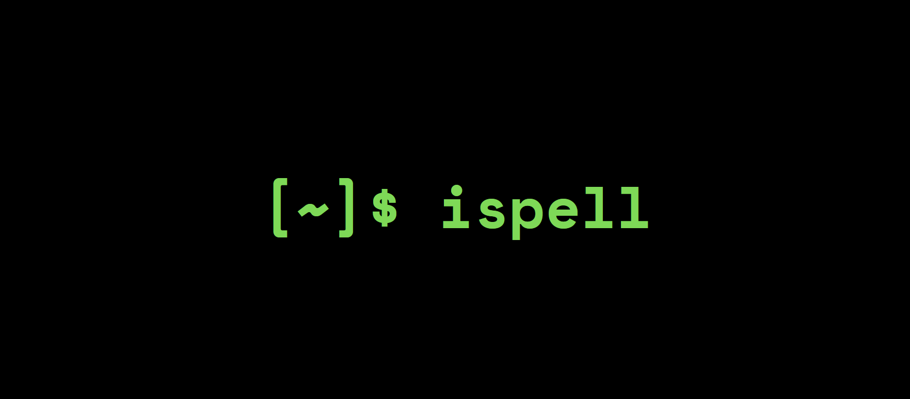

<p align="center">
  
</p>

# 作业 4：Ispell

截止时间：5 月 8 日（星期五）23:59

## 概述

我们已经学习了 STL 的核心组成——容器、迭代器、函数对象和算法，以及支撑这一切的关键机制——模板。现在把这些知识组合起来！

本作业需要编写经典 Unix 风格拼写检查器 [Ispell](https://en.wikipedia.org/wiki/Ispell) 的核心逻辑。你会使用 `<algorithm>` 头文件以及新的 C++ ranges 库。

你的代码全部写在 `spellcheck.cpp` 中。完成后会得到如下拼写检查器：

<p align="center">
  
</p>

> [!IMPORTANT]
> 这份说明看起来很长，但实际需要编写的代码并不多。文档加入了大量细节，是为了让实现过程更清楚。如有疑问，可以在 Ed、课堂或答疑时间提问。周二（05/05）的课堂还会讲解 `tokenize`，帮助大家开始本作业。

开始前，请先按照[环境配置说明](../assignment-setup/README.md)下载并配置起始代码。

## 运行代码

打开终端（VSCode 中可按 <kbd>Ctrl+`</kbd>，或选择 **Terminal > New Terminal**），确认当前位于 `assignment4/` 目录，然后编译：

```sh
g++ -std=c++20 main.cpp spellcheck.cpp -o main
```

如果编译没有报错，请运行 `./main`。建议在完成下述步骤时经常编译并运行自动评分器。

> [!NOTE]
>
> ### Windows 用户说明
>
> Windows 上可能需要使用以下命令编译：
>
> ```sh
> g++ -static-libstdc++ -std=c++20 main.cpp spellcheck.cpp -o main
> ```
>
> 生成的文件也可能名为 `main.exe`，此时请运行 `./main.exe`。

## 构建 Ispell

经典 Unix 程序 Ispell 的工作方式如下：首先把包含常用英语单词的词典加载到内存中；如果某个单词无法在词典中找到，就认为它拼写错误。程序使用 [Damerau–Levenshtein 距离](https://en.wikipedia.org/wiki/Damerau%E2%80%93Levenshtein_distance)为每个错误单词寻找建议。该距离近似表示把一个单词变成另一个单词所需的编辑次数；一次编辑可以添加、删除或替换一个字母，也可以交换两个相邻字母。如果错误单词与某个词典单词之间的距离恰好为 1，就把该词典单词加入建议列表。这是因为拼写错误通常只差一次小改动，例如 `"mispelled"` 与 `"misspelled"`。

仓库已经提供构建拼写检查器所需的基础设施，包括 Damerau–Levenshtein 函数的实现。你需要完成两个核心算法：`tokenize` 把输入字符串切分为 token 集合，`spellcheck` 根据 token 化的输入与词典找出拼写错误。为了练习上周课程内容，代码中不能使用任何 `for`/`while` 循环：`tokenize` 必须使用传统 STL 算法，`spellcheck` 必须使用新的 ranges 库。通过本作业，你会练习使用算法与 lambda 操作现代 C++ 数据结构。

下面会逐步讲解两个算法。

### `tokenize`

```cpp
struct Token { std::string content; size_t src_offset; };
using Corpus = std::set<Token>;
Corpus tokenize(std::string& input);
```

`tokenize` 接收一个输入字符串，并将其拆分成一组 `Token` 对象。请查看 `spellcheck.h` 中的 `Token` 结构体。从概念上说，`Token` 是较长文本中的一个单词；在代码中，它是文件中从索引 `src_offset` 开始出现的 `std::string`。我们的目标是把输入文件拆分为一组 `Token`，这组数据称为 `Corpus`（`Corpus` 只是 `std::set<Token>` 的类型别名）。

本题的关键约束是：token 两侧是空白字符或输入边界。例如，字符串 `"history will absolve me"` 包含四个 token：

- `{ content: "history", src_offset: 0 }`
- `{ content: "will", src_offset: 8 }`
- `{ content: "absolve", src_offset: 13 }`
- `{ content: "me", src_offset: 21 }`

实现 `tokenize` 时，不使用 `for`/`while` 循环，而是使用 `std::transform` 等传统 STL 算法。总体策略如下：

1. 找出指向所有空白字符的迭代器。
2. 在相邻空白字符之间生成 token。
3. 删除空 token。

具体步骤如下。

1. **第一步：找出指向所有空白字符的迭代器**

   如果取得字符串中所有指向空白字符的迭代器，就可以把任意两个相邻空白字符之间的内容视为 token。我们似乎需要反复调用 `find_if` 来收集这些迭代器，不过仓库已经提供了专门完成此任务的 `find_all`。

   > 📄 [**`find_all`**](./utils.cpp)
   >
   > ```cpp
   > template <typename Iterator, typename UnaryPred>
   > std::vector<Iterator> find_all(Iterator begin, Iterator end, UnaryPred pred);
   > ```
   >
   > 返回 `begin` 与 `end` 之间所有满足一元谓词 `pred` 的元素迭代器。**返回向量还会包含边界迭代器 `begin` 和 `end`。**也就是说，对返回向量中的任意迭代器 `it`，必有 `pred(*it)`、`it == begin` 或 `it == end` 至少一个成立。向量中的迭代器保证有序。

   对 `source` 字符串调用 `find_all`，并传入判断字符是否为空白的一元谓词，即可得到所需迭代器。C++ 内置了这样的函数：`isspace`。

   > 📄 [**`std::isspace`**](https://en.cppreference.com/w/c/string/byte)
   >
   > 作为谓词传递时，必须写成 `std::isspace`[^1]。
   >
   > ```cpp
   > int std::isspace(int ch);
   > ```

[^1]: `std::isspace` 实际存在多个版本：

    ```cpp
    int isspace(int ch);                          // 定义于 <cctype> 和 <ctype.h>

    template <class CharT>
    bool isspace(CharT ch, const locale& loc);    // 定义于 <locale>
    ```

    严格来说，第一个版本既[位于 `namespace std` 中](https://en.cppreference.com/w/cpp/header/cctype)，也作为[从 C 继承的全局函数](https://en.cppreference.com/w/c/string/byte)存在；第二个版本位于 `std` 中，并定义于 `<locale>`。单独写 `isspace` 会引用 C 版本，而 `std::isspace` 会涉及上述重载，因此编译器可能难以推断 `UnaryPred` 类型参数。

    有时也会看到 `::isspace`，它明确要求 C++ 在*全局命名空间*（而不是 `std`）中查找 `isspace`，效果相同。

2. **第二步：在相邻空白字符之间生成 token**

   取得全部空白字符迭代器后，可以把任意两个相邻迭代器之间的字符范围视为一个 token：

   ```text
   "history will absolve me"
    ▲      ▲    ▲       ▲  ▲
    ├──────┼────┼───────┼──┤
    │  t1  │ t2 │   t3  │t4│
   ```

   箭头表示 `find_all` 返回的迭代器，任意两个箭头之间的字符就是一个 token。不必担心迭代器是否确实指向空白，也不必自己去除 token 两端字符：`Token` 提供了一个接收两个迭代器的构造函数，会自动清理边缘空白。

   > 📄 [**`Token`**](./spellcheck.cpp)
   >
   > ```cpp
   > template <typename It>
   > Token(std::string& source, It begin, It end);
   > ```
   >
   > 根据源字符串 `source` 以及标记 token 范围的迭代器 `begin`、`end` 构造一个 token，并自动去除 token 边缘多余的空白和标点。

   需要为每一对相邻迭代器调用该构造函数。为此，使用 [`std::transform` 的重载 (3)](https://en.cppreference.com/w/cpp/algorithm/transform)：

   > 📄 [**`std::transform`**](https://en.cppreference.com/w/cpp/algorithm/transform)
   >
   > ```cpp
   > template <class InputIt1, class InputIt2, class OutputIt, class BinaryOp>
   > OutputIt std::transform(InputIt1 first1, InputIt1 last1, InputIt2 first2,
   >                         OutputIt d_first, BinaryOp binary_op);
   > ```
   >
   > 给定两个等长范围（第一个从 `first1` 开始、在 `last1` 结束，第二个从 `first2` 开始），函数对两范围中的每对对应元素应用二元函数 `binary_op`，例如 `binary_op(first1, first2)`、`binary_op(first1 + 1, first2 + 1)`，并从 `d_first` 开始把结果写入同样大小的输出范围。

   `binary_op` 可以是一个接收两个 `std::string::iterator`（也可以像课堂上所讲，用 `auto` 参数）`it1`、`it2` 的 lambda，并通过 `Token { source, it1, it2 }` 构造 token。该构造函数需要 `source`，所以 lambda 必须捕获它。**一定要按引用捕获 `source`，否则代码无法正确运行。**

   > **‼️⚠️📢🚨 警告 🚨📢⚠️‼️**
   > 这一点过去经常出错，因此再次强调：为了让 `Token` 构造函数正常工作，lambda 必须**按引用捕获 `source`**。如果忘记语法，请回顾 lambda 捕获相关课程内容。

   对输出范围 `d_first`，先创建一个 `std::set<Token>` 保存找到的 token。假设集合名为 `tokens`，那么可以使用 [`std::inserter(tokens, tokens.end())`](https://en.cppreference.com/w/cpp/iterator/inserter) 将结果插入其中。

   > 📄 [**`std::inserter`**](https://en.cppreference.com/w/cpp/iterator/inserter)
   >
   > ```cpp
   > template <class Container>
   > std::insert_iterator<Container> inserter(Container& c, typename Container::iterator i);
   > ```
   >
   > 返回一个输出迭代器，把写入它的值插入容器 `c` 的位置 `i`。返回值类型为 `std::insert_iterator<Container>`，可以作为 `std::transform` 等 STL 算法的输出范围。
   >
   > `std::inserter` 返回的迭代器与此前常见的迭代器略有不同，但它仍然是输出迭代器。其他算法可以解引用并写入它，而它会在内部把元素插入底层容器。

   输入范围 `first1`、`last1` 和 `first2` 的选取需要一点技巧：应让 `binary_op(first1, first2)` 构造第一个 token，`binary_op(first1 + 1, first2 + 1)` 构造第二个 token，依此类推。如何设置参数，才能让 `binary_op` 依次作用于相邻两对空白迭代器？**提示：`first1` 所在范围完全可以与 `first2` 所在范围重叠。**

3. **第三步：删除空 token**

   当前生成的 token 中可能有空值，例如字符串包含连续多个空白字符时。可以使用 [`std::erase_if`](https://en.cppreference.com/w/cpp/container/set/erase_if) 删除 `std::set` 中满足条件的元素。

   > 📄 [**`std::erase_if`**](https://en.cppreference.com/w/cpp/container/set/erase_if)
   >
   > ```cpp
   > template <class Key, class Compare, class Alloc, class Pred>
   > std::set<Key, Compare, Alloc>::size_type erase_if(
   >     std::set<Key, Compare, Alloc>& c, Pred pred);
   > ```

   `pred` 可以使用检查 token 是否为空的 lambda，例如检查 `token.content.empty()`。最后返回包含全部有效 token 的 `tokens`。

完成后，拼写检查器应该能够报告 token 数量。重新编译并运行：

```sh
./main "hello wrld"
```

应看到：

```text
Loading dictionary... loaded 464811 words.
Tokenizing input... got 2 tokens.
```

`tokenize` 已经快速处理了约五十万个单词的英语词典和输入字符串 `"hello wrld"`。但此时程序还没有真正检查拼写，`"wrld"` 仍会被视为正确。接下来实现 `spellcheck`。

### `spellcheck`

```cpp
struct Misspelling { Token token; std::set<std::string> suggestions; };
using Dictionary = std::unordered_set<std::string>;
std::set<Misspelling> spellcheck(const Corpus& source, const Dictionary& dictionary);
```

`spellcheck` 接收 token 化后的 `Corpus`（即 `tokenize` 的输出）和 `Dictionary`（表示所有合法英语单词的 `std::unordered_set<std::string>`），返回一组 `Misspelling`。每个 `Misspelling` 都记录拼错的 `token`，以及可以替换它的建议单词集合。

我们将在 `std::ranges::views` 命名空间下使用新的 ranges/views 库，按以下算法识别拼写错误：

1. 跳过已经拼写正确的单词。
2. 对其余单词，使用 Damerau–Levenshtein 距离在词典中找出只差一次编辑的单词。
3. 删除没有任何建议的拼写错误。

具体步骤如下。

1. **第一步：跳过已经拼写正确的单词**

   如果单词出现在 `dictionary` 中，就说明拼写正确。例如，`dictionary.contains("world")` 返回 `true`，而 `dictionary.contains("wrld")` 返回 `false`。首先使用 `std::ranges::views::filter` 跳过 `source` 中拼写正确的单词。

   > 📄 [**`std::ranges::views::filter`**](https://en.cppreference.com/w/cpp/ranges/filter_view)
   >
   > ```cpp
   > template <ranges::viewable_range R, class Pred>
   > constexpr ranges::view auto filter(R&& r, Pred&& pred);
   >
   > template <class Pred>
   > constexpr /* 范围适配器闭包 */ filter(Pred&& pred);
   > ```
   >
   > `filter(r, pred)` 返回一个适配底层范围 `r` 的 view；遍历时只包含满足 `pred` 的元素。`filter(pred)` 创建一个范围适配器，可以通过 `operator|` 链接到范围上。

   `std::ranges::views` 流水线把多个范围处理步骤串联起来。每一步都通过 lambda *适配*前一步，并以惰性方式执行过滤或转换。`filter` 有两种等价写法：

   ```cpp
   auto view = std::ranges::views::filter(source, /* lambda 谓词 */);

   /* 等价于 */

   auto view = source | std::ranges::views::filter(/* lambda 谓词 */);
   ```

   第二种语法便于通过 `operator|` 继续串联步骤。由于 `std::ranges::views::filter` 较长，通常会定义命名空间别名：

   ```cpp
   namespace rv = std::ranges::views;
   auto view = source | rv::filter(/* lambda 谓词 */);
   ```

   自动评分器接受两种写法。请将 `/* lambda 谓词 */` 替换为接收 `Token`、并在其内容拼写**错误**时返回 `true` 的 lambda。lambda 需要访问 `dictionary`，因此必须捕获它；想一想应该按引用还是按值捕获。

2. **第二步：使用 Damerau–Levenshtein 距离寻找只差一次编辑的单词**

   此时 `view` 表示 `source` 中所有拼写错误的 token。使用 `std::ranges::views::transform` 把每个错误 token 转换为相应的 `Misspelling`，同时生成建议。

   > 📄 [**`std::ranges::views::transform`**](https://en.cppreference.com/w/cpp/ranges/transform_view)
   >
   > ```cpp
   > template <ranges::viewable_range R, class F>
   > constexpr ranges::view auto transform(R&& r, F&& func);
   >
   > template <class F>
   > constexpr /* 范围适配器闭包 */ transform(F&& func);
   > ```
   >
   > `transform(r, func)` 返回适配底层范围 `r` 的 view。遍历时，每个元素 `e` 都会通过 `func(e)` 转换为新元素。`transform(func)` 创建可以通过 `operator|` 链接到范围上的适配器。

   与上一步组合后，代码结构大致如下：

   ```cpp
   namespace rv = std::ranges::views;
   auto view = source
       | rv::filter(/* lambda 谓词 */)
       | rv::transform(/* 接收 Token、返回 Misspelling 的 lambda */);
   ```

   <sup>这只是其中一种写法。使用 `transform(r, func)` 重载或不定义 `rv` 别名也完全可以。</sup>

   `transform` 的 lambda 应接收一个 `Token`，并返回包含该 token 全部候选拼写的 `Misspelling`。为生成建议，需要遍历 `dictionary`，找出所有与 `token.content` 的 Damerau–Levenshtein 距离恰好为 `1` 的单词。可以使用仓库提供的 `levenshtein`：

   > 📄 [**`levenshtein`**](./spellcheck.h)
   >
   > ```cpp
   > size_t levenshtein(const std::string& a, const std::string& b);
   > ```
   >
   > 返回 `a` 与 `b` 之间的 Damerau–Levenshtein 距离，大致表示把 `a` 变为 `b` 所需的修改次数。实际实现经过高度优化，一旦能够确定距离大于 `1`，就会提前退出。

   对**每一个**拼错的单词，都需要遍历 `dictionary` 寻找建议。因此，必须在接收 `Token`、返回 `Misspelling` 的外层 lambda 中，再嵌套一次 `std::ranges::views::filter`。为了触发惰性计算并把建议 view 实体化为集合，可使用 [`std::set` 构造函数的重载 (4)](https://en.cppreference.com/w/cpp/container/set/set)：

   > 📄 [**`std::set`**](https://en.cppreference.com/w/cpp/container/set/set)
   >
   > ```cpp
   > template <class InputIt>
   > set(InputIt first, InputIt last,
   >     const Compare& comp = Compare(),
   >     const Allocator& alloc = Allocator());
   > ```
   >
   > 使用 `[first, last)` 迭代器范围中的元素构造一个 `set`。

   例如：

   ```cpp
   auto view = dictionary | rv::filter(/* lambda 谓词 */);
   std::set<std::string> suggestions(view.begin(), view.end());
   ```

   最后可以通过统一初始化，从 `token` 和 `suggestions` 构造 `Misspelling`：

   ```cpp
   Misspelling { token, suggestions }
   ```

   这应作为外层 transform lambda 的返回值。

3. **第三步：删除没有建议的拼写错误**

   此时 `view` 包含全部错误单词及其建议，但有些 `Misspelling` 的建议集合可能为空。例如，乱码 `"adskadnfknfs"` 明显拼错了，却没有任何英语单词只需一次编辑就能变成它。返回前需要删除这些没有建议的对象。

   再次对 `view` 应用 `std::ranges::views::filter` 即可。过滤后，按照第二步处理 `suggestions` 的方式，用迭代器构造 `std::set<Misspelling>` 并返回。

   > ⚠️ [**`std::ranges::to`**](https://en.cppreference.com/w/cpp/ranges/to)
   > 课堂上曾使用 `std::ranges::to` 把 `char` view 实体化为 `std::string`：
   >
   > ```cpp
   > auto v = s | rv::filter(isalpha)
   >            | /* 其他步骤 */
   >            | std::ranges::to<std::string>();
   > ```
   >
   > 你可能会想使用 `std::ranges::to<std::set<Misspelling>>()`，思路没有问题，但 `std::ranges::to` 直到 C++23 才加入。不同编译器版本可能支持，也可能不支持。为了保证自动评分器可以编译，请使用接收迭代器的 `std::set<Misspelling>` 构造函数。**本作业只应使用不晚于 C++20 的特性。**

完成以上步骤后，拼写检查器应当可以正常工作。重新编译并运行：

```sh
./main "This string is mispelled"
```

应看到类似输出：

<p align="center">
  
</p>

也可以检查仓库提供的示例：

```sh
./main --stdin < "examples/(marquez).txt"
```

> [!NOTE]
> **PowerShell 用户：**在 Microsoft PowerShell（Windows）中，检查示例文件的命令略有不同：
>
> ```sh
> Get-Content "examples/(marquez).txt" | ./main --stdin
> ```

> [!NOTE]
> 建议尝试拼写检查器的不同选项并观察行为。完整用法如下；代码块保留程序实际使用的英文参数说明：
>
> ```text
> ./main [--dict dict_path] [--stdin] [--unstyled] [--profile] text
>
> --dict dict_path  Sets the location of the dictionary. Defaults to words.txt
> --stdin           Read from stdin. You can use this to pipe input from a file
> --unstyled        Don't add any color to the output!
> --profile         Profile the code, printing out how long tokenizing/spellcheck took
> text              The text you want to spellcheck, if not using stdin
> ```
>
> 如果想接受额外挑战，可以使用 `--profile` 运行程序。尽管当前算法采用朴素暴力方式遍历约五十万个单词的完整词典，运行速度仍然很快。你可以尝试在保证输出正确的前提下继续优化性能；这完全是可选内容。

## 🚀 提交说明

重新编译并运行自动评分器，完整测试拼写检查器：

```sh
./main
```

通过全部测试后即可提交：

1. 填写[反馈表](https://forms.gle/AMq7kvVKprKmBafKA)。
2. 在 [Paperless](https://paperless.stanford.edu) 上提交作业。

需要提交：

- `spellcheck.cpp`

截止时间前可以重复提交任意次数。
